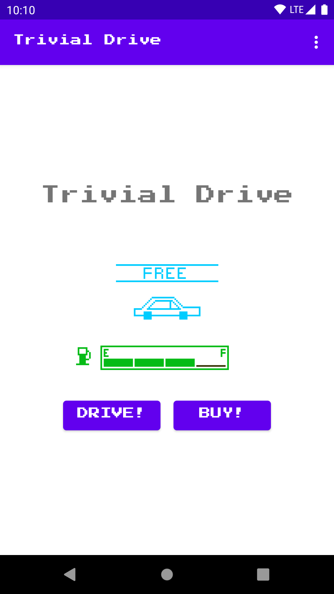

Trivial Drive (Kotlin)
======================

Sample for Google Play Billing Library version 4

Introduction
------------

This sample is provided to demonstrate using the Google Play Billing Library
with Billing KTX for in-app items and simple subscriptions. To read more visit 
https://developer.android.com/google/play/billing/index.html

This game is a simple "driving" game where the player can buy gas
and drive. The car has a tank which stores gas. When the player purchases
gas, the tank fills up (1/4 tank at a time). When the player drives, the gas
in the tank diminishes (also 1/4 tank at a time).

The user can also purchase a "premium upgrade" that gives them a red car
instead of the standard blue one (exciting!).

The user can also purchase a subscription ("infinite gas") that allows them
to drive without using up any gas while that subscription is active. The
subscription can either be purchased monthly or yearly.

Pre-requisites
--------------

- [Documentation](https://developer.android.com/google/play/billing/billing_overview.html)

Screenshots
-----------

Getting Started
---------------

This sample will warn you if you don't supply a base64EncodedPublicKey in your local.properties,
which is used for purchase signature validation. If you just want to run the sample, you can put 
anything in there to get past the Gradle build check, but in order to get the rest of the sample
to function, you need to create an application instance in the Google Play Developer Console and
add matching in-app-purchase SKUs.

ON THE GOOGLE PLAY DEVELOPER CONSOLE

1. Create an application on the Developer Console, available at
   https://play.google.com/apps/publish/.

2. Copy the application's public key (a base-64 string). You can currently find this under
   Monetization Setup->Licensing.

IN THE CODE

3. Create or open local.properties.  Add base64EncodedPublicKey=the key value you copied"

4. Change the sample's package name to your package name. To do that, update the
   package name in AndroidManifest.xml and correct the references (especially the
   references to the R object).

5. Export an APK, signing it with your PRODUCTION (not debug) developer certificate. This cert is
   only used for securely communicating with Google Play App Signing, and will not be used for 
   publishing by Google Play.

BACK TO THE GOOGLE PLAY DEVELOPER CONSOLE

6. Upload your APK to Google Play for Internal Testing. Any other track will require that your app
   has complete assets and metadata for publishing.  Add testers here.

7. Go into the main developer console settings and go to License Testing.  Add accounts here that
   will be used for testing. These accounts will get to make test purchases _and_ can used builds
   signed with a different signature.

8. Under In-app Products, create products with these Product IDs:
       premium, gas

9. Under Subscriptions, create SUBSCRIPTION items with these IDs:
       infinite_gas_monthly, infinite_gas_yearly

10. Publish your APK to the internal testing channel. It should be ready to test almost immediately.
 
TEST THE CODE

11. Install the APK signed with your debug certificate, to a test device with a test account on it.
12. Run the app.
13. Make (test) purchases!

If you make any real purchases, you can refund them. You can use the tester functionality within
the Google Play console to define test Google Accounts that won't be charged.
When using the tester functionality make sure to look for "Test" language appended to each 
purchase in the device UI and in the receipt. If you don't see "Test" then you will need to be 
sure to refund/cancel the charge.

A NOTE ABOUT SECURITY
---------------------

This sample app implements signature verification but does not demonstrate
how to enforce a tight security model. When releasing a production application
to the general public, we highly recommend that you implement the security best
practices described in our documentation at:

https://developer.android.com/google/play/billing/security

In particular, you should set developer payload strings when making purchase
requests and you should verify them when reading back the results. This will make
it more difficult for a malicious party to perform a replay attack on your app.

Support
-------
If you've found an error in this sample, please file an issue:
https://github.com/googlesamples/android-play-billing/issues

Patches are encouraged, and may be submitted by forking this project and
submitting a pull request through GitHub.

License
-------
Copyright 2021 Google, Inc.

Licensed to the Apache Software Foundation (ASF) under one or more contributor
license agreements.  See the NOTICE file distributed with this work for
additional information regarding copyright ownership.  The ASF licenses this
file to you under the Apache License, Version 2.0 (the "License"); you may not
use this file except in compliance with the License.  You may obtain a copy of
the License at

  http://www.apache.org/licenses/LICENSE-2.0

Unless required by applicable law or agreed to in writing, software
distributed under the License is distributed on an "AS IS" BASIS, WITHOUT
WARRANTIES OR CONDITIONS OF ANY KIND, either express or implied.  See the
License for the specific language governing permissions and limitations under
the License.

CHANGELOG
---------

   2012-11-29: Initial release
   2013-01-08: Updated to include support for subscriptions
   2015-03-13: Updated to new dev console and added yearly subscriptions
   2015-08-27: Ported to gradle and prepped for transitioning to GitHub
   2021-04-28: Rewritten and updated to support Google Play Billing Library V3
